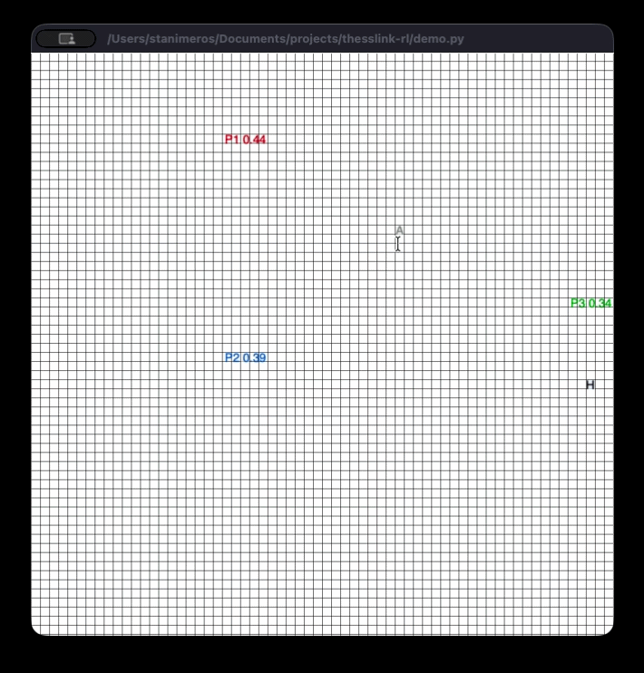
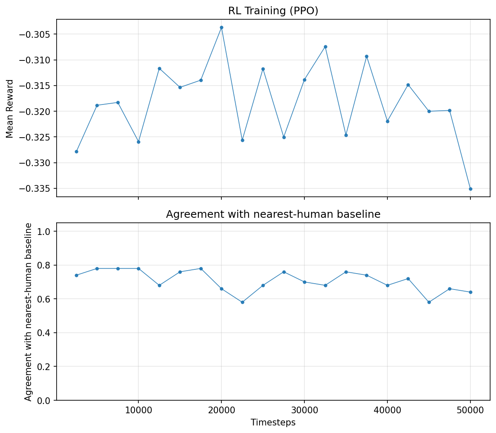
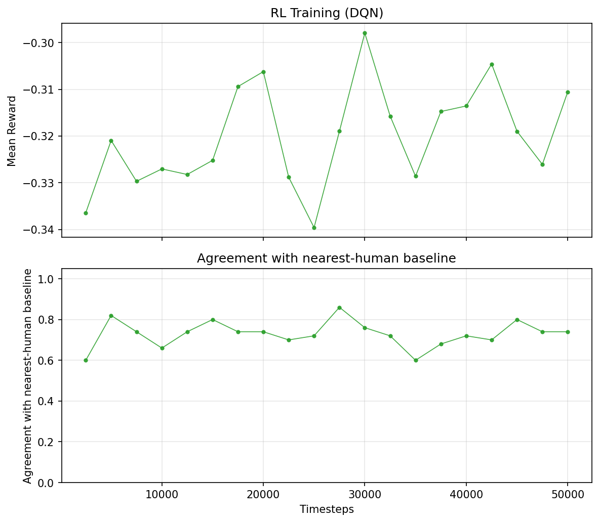

# ThessLink RL

**Reinforcement Learning** for meeting point suggestion. The model takes **Travel Effort** (agent, human distances), **Time-to-Meet**, **energy** (penalizes human travel—closer POIs cost less), and **privacy** (prefer meeting near human's location), calculates a cost for each POI, and selects the **minimum cost**.



## Overview

- **Inputs:** Human position, agent position, 3 POI suggestions (64×64 grid)
- **Cost components per POI:** Travel Effort (agent, human), energy (human effort, range [0.2, 0.8]), privacy (prefer near human), Time-to-Meet
- **Output:** POI with minimum cost
- **Reward:** `-cost` (RL learns to minimize cost)
- **Baseline:** `pick_best_poi` (cost formula) used for RL evaluation
- **Demo:** Shows steps + cost per POI

## Setup

```bash
python -m venv .venv
source .venv/bin/activate  # or .venv\Scripts\activate on Windows
pip install -e lb-foraging/
pip install -r requirements.txt
```

## Usage

### 1. Train policy-based model (`policy_based_train.py`)

```bash
python policy_based_train.py              # Train PPO 50k steps (cost reward), save to models/
python policy_based_train.py --steps 100000
python policy_based_train.py --no-plot   # Skip generating training_plot_ppo.png
python policy_based_train.py --no-train  # Evaluate loaded model vs cost baseline
```

Produces `models/ppo/best_model.zip`, `models/ppo/ppo_poi_suggestion.zip`, and `training_plot_ppo.png`.



### 2. Train value-based model (`value_based_train.py`)

DQN (value-based RL) for POI suggestion. Same env and reward; outputs Q-values per action.

```bash
python value_based_train.py              # Train DQN 50k steps, save training_plot_dqn.png
python value_based_train.py --steps 100000
python value_based_train.py --no-plot   # Skip plot
python value_based_train.py --no-train  # Evaluate only
```

Produces `models/dqn/best_model.zip`, `models/dqn/dqn_poi_suggestion.zip`, and `training_plot_dqn.png`. Use `suggest_poi_dqn()` for inference.



### 3. Run demo (`demo.py`)

Shows **cost** per POI with color-coded labels (green=optimal, blue=less, red=worst). Choose which model to use for POI suggestion.

```bash
python demo.py                         # 5 scenarios, PPO model (default)
python demo.py --model ppo             # Policy-based (PPO)
python demo.py --model dqn             # Value-based (DQN)
python demo.py --model cost            # Cost baseline (no RL)
python demo.py --scenarios 10
python demo.py --scenarios 0           # Infinite until window closed
python demo.py --no-visualize
```

## Project structure

```
thesslink-rl/
├── cost_function.py        # cost_components, cost_function, pick_best_poi
├── poi_environment.py      # Gymnasium env for POI suggestion (RL)
├── policy_based_train.py   # PPO training (policy-based), suggest_poi_rl()
├── value_based_train.py    # DQN training (value-based), suggest_poi_dqn()
├── demo.py                 # Demo with cost display (--model ppo|dqn|cost)
├── models/                 # RL models
│   ├── ppo/                # PPO: best_model.zip, ppo_poi_suggestion.zip
│   └── dqn/                # DQN: best_model.zip, dqn_poi_suggestion.zip
├── training_plot_ppo.png   # PPO training plot
├── training_plot_dqn.png   # DQN training plot
├── lb-foraging/            # lb-foraging env (visualization)
├── requirements.txt
└── README.md
```

## Cost formula (current)

The current cost function combines distance, energy, privacy, and time-to-meet. Lower cost = better POI suggestion.

### Main cost

$$\text{cost} = w_{TE_a} \cdot d_A + w_{TE_h} \cdot d_H + w_e \cdot e + w_p \cdot p + w_{TTM} \cdot ttm$$

### Variable definitions

| Symbol | Formula | Description |
|--------|---------|--------------|
| $d_A$ | $\frac{\text{Manhattan}(\text{agent}, \text{POI})}{D_{\max}}$ | Travel Effort (agent → POI), normalized |
| $d_H$ | $\frac{\text{Manhattan}(\text{human}, \text{POI})}{D_{\max}}$ | Travel Effort (human → POI), normalized |
| $D_{\max}$ | $\text{rows} + \text{cols}$ | Max Manhattan distance on grid |
| $e$ | $0.2 + 0.6 \cdot d_H$ | Energy expenditure, range $[0.2, 0.8]$ |
| $p$ | $1 - d_H$ | Privacy (higher when POI near human) |
| $ttm$ | $\max(d_A, d_H)$ | Time-to-Meet |

### Weighted sum (expanded)

$$\text{cost} = w_{TE_a} \cdot d_A + w_{TE_h} \cdot d_H + w_e \cdot (0.2 + 0.6 d_H) + w_p \cdot (1 - d_H) + w_{TTM} \cdot \max(d_A, d_H)$$

Default weights: $w_{TE_a} = w_{TE_h} = w_e = w_p = w_{TTM} = 0.20$.

### Related improvements / ideas

- **Fairness (minimax):** Minimize max effort instead of sum—balance burden between human and agent.
- **A* paths:** Replace Manhattan with actual path length when obstacles exist.
- **User preferences:** Learn or adapt weights per user (e.g., preference-based RL).
- **SOC vs. Makespan:** Sum-of-costs (total effort) vs. makespan (time until both meet)—already partially captured by TTM.
- **Privacy variants:** Crowd exposure, anonymity, distance from home.
- **Energy variants:** Terrain, elevation, vehicle type (e.g., drone, robot taxi, pedestrian).
- **Negotiation:** Alternating offers, Pareto-optimal compromise between human and agent preferences.

## Reinforcement Learning

- **State:** Normalized positions + cost components (Travel Effort, energy, privacy, Time-to-Meet) per POI
- **Action:** Discrete(3) – which POI to suggest
- **Reward:** `-cost` – minimize cost

## Flow

1. **policy_based_train.py** – Train policy-based (PPO) → `models/ppo/`
2. **value_based_train.py** – Train value-based (DQN) → `models/dqn/`
3. **demo.py** – Load model (--model ppo|dqn|cost) → suggest POI → visualize

## License

Uses [lb-foraging](https://github.com/semitable/lb-foraging) (MIT) for visualization. The `lb-foraging/` folder is a full copy (not a submodule) with modifications for ThessLink: `allow_agent_on_food` and `allow_agent_on_agent` so agents can move onto POIs and share cells.
