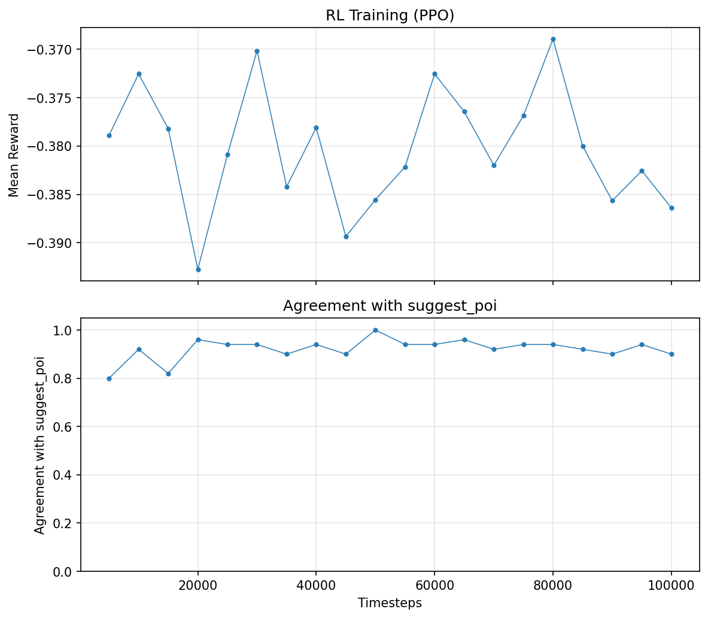

# ThessLink RL

**Reinforcement Learning** for meeting point suggestion. The model takes **Travel Effort** (agent, human distances), **Time-to-Meet**, **energy** (penalizes human travel—closer POIs cost less), and **privacy** (prefer meeting near human's location), calculates a cost for each POI, and selects the **minimum cost**.


## Overview

- **Inputs:** Human position, agent position, 3 POI suggestions (64×64 grid)
- **Cost components per POI:** Travel Effort (agent, human), energy (human effort, range [0.2, 0.8]), privacy (prefer near human), Time-to-Meet
- **Output:** POI with minimum cost
- **Reward:** `-cost` (RL learns to minimize cost)
- **Baseline:** `pick_best_poi` (cost formula) used for RL evaluation
- **Demo:** Shows steps + cost per POI

## Setup

```bash
python -m venv .venv
source .venv/bin/activate  # or .venv\Scripts\activate on Windows
pip install -e lb-foraging/
pip install -r requirements.txt
```

## Usage

### 1. Train RL policy (`train.py`)

```bash
python train.py                    # Train PPO 50k steps (cost reward), save to models/
python train.py --steps 100000     # More training
python train.py --no-plot          # Skip generating training_plot.png
python train.py --no-train         # Evaluate loaded model vs cost baseline
```

Produces `models/best_model.zip`, `models/ppo_poi_suggestion.zip`, and `training_plot.png`.



### 2. Run demo (`demo.py`)

Uses cost-based POI suggestion. Shows **cost** per POI with color-coded labels (green=optimal, blue=less, red=worst).

```bash
python demo.py                    # 5 scenarios, 3 POIs
python demo.py --scenarios 10
python demo.py --scenarios 0      # Infinite (until window closed)
python demo.py --no-visualize
```

## Project structure

```
thesslink-rl/
├── cost_function.py    # cost_components, cost_function, pick_best_poi
├── poi_environment.py  # Gymnasium env for POI suggestion (RL)
├── train.py            # PPO training, suggest_poi_rl()
├── demo.py             # Demo with cost display
├── models/              # RL models (best_model.zip, ppo_poi_suggestion.zip)
├── training_plot.png   # RL training plot
├── lb-foraging/        # lb-foraging env (visualization)
├── requirements.txt
└── README.md
```

## Cost formula

### Main cost

$$\text{cost} = w_{TE_a} \cdot d_A + w_{TE_h} \cdot d_H + w_e \cdot e + w_p \cdot p + w_{TTM} \cdot ttm$$

### Variable definitions

| Symbol | Formula | Description |
|--------|---------|--------------|
| $d_A$ | $\frac{\text{Manhattan}(\text{agent}, \text{POI})}{D_{\max}}$ | Travel Effort (agent → POI), normalized |
| $d_H$ | $\frac{\text{Manhattan}(\text{human}, \text{POI})}{D_{\max}}$ | Travel Effort (human → POI), normalized |
| $D_{\max}$ | $\text{rows} + \text{cols}$ | Max Manhattan distance on grid |
| $e$ | $0.2 + 0.6 \cdot d_H$ | Energy expenditure, range $[0.2, 0.8]$ |
| $p$ | $1 - d_H$ | Privacy (higher when POI near human) |
| $ttm$ | $\max(d_A, d_H)$ | Time-to-Meet |

### Weighted sum (expanded)

$$\text{cost} = w_{TE_a} \cdot d_A + w_{TE_h} \cdot d_H + w_e \cdot (0.2 + 0.6 d_H) + w_p \cdot (1 - d_H) + w_{TTM} \cdot \max(d_A, d_H)$$

Lower cost = better suggestion. Default weights: $w_{TE_a} = w_{TE_h} = w_e = w_p = w_{TTM} = 0.20$.

## Reinforcement Learning

- **State:** Normalized positions + cost components (Travel Effort, energy, privacy, Time-to-Meet) per POI
- **Action:** Discrete(3) – which POI to suggest
- **Reward:** `-cost` (default) – minimize cost

## Flow

1. **train.py** – Train RL policy (PPO, cost reward) → `models/best_model.zip`
2. **demo.py** – Load RL model → suggest POI → visualize

## License

Uses [lb-foraging](https://github.com/semitable/lb-foraging) (MIT) for visualization. The `lb-foraging/` folder is a full copy (not a submodule) with modifications for ThessLink: `allow_agent_on_food` and `allow_agent_on_agent` so agents can move onto POIs and share cells.
