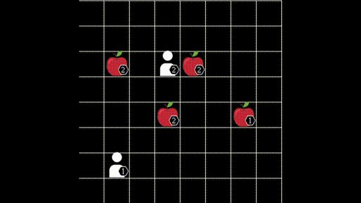
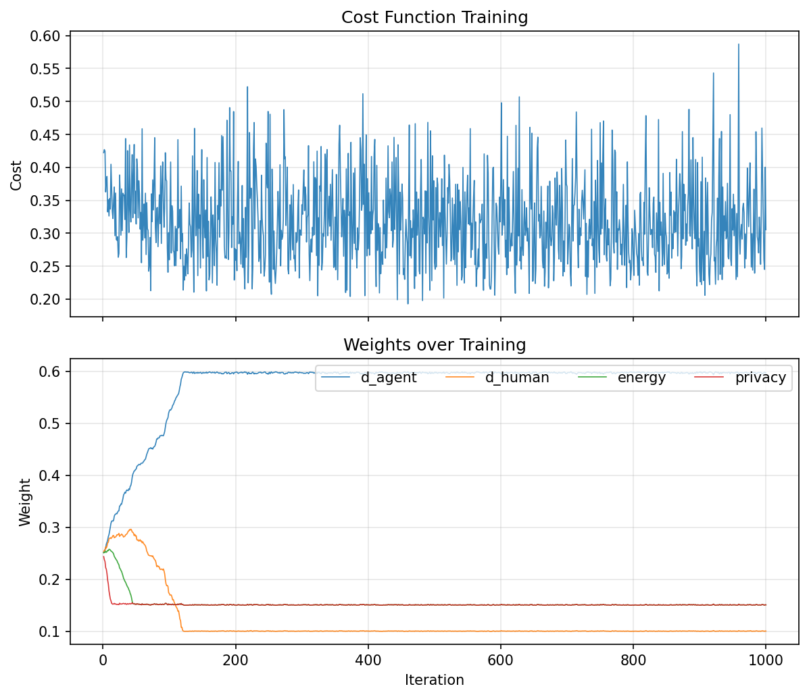

# ThessLink RL

Cost/reward function for meeting point suggestion. The agent suggests the best POI (Point of Interest) from 3 options based on **agent distance**, **human distance**, **energy**, and **privacy**. Weights are learned via gradient descent.



## Overview

- **Inputs:** Human position, agent position, 3 POI suggestions
- **Output:** Agent suggests the best meeting point (lowest cost)
- **Factors:** d_agent, d_human (Manhattan distances), energy_human (20–80%), privacy (basic)
- **Weights:** Learned via gradient descent in `cost_function.py` (min bounds keep all factors in play)
- **Visualization:** lb-foraging grid with H, A, P1, P2, P3 labels

## Setup

```bash
python -m venv .venv
source .venv/bin/activate  # or .venv\Scripts\activate on Windows
pip install -e lb-foraging/
pip install -r requirements.txt
```

## Usage

### 1. Train and save weights (`cost_function.py`)

```bash
python cost_function.py                    # Train 1000 iters, save weights + plot
python cost_function.py --no-train         # Show current weights (no training)
python cost_function.py --iterations 5000  # Custom iterations
python cost_function.py --no-plot          # Skip generating cost_training_plot.png
```

Produces `thesslink_weights.json` and `cost_training_plot.png`.



### 2. Run demo (`run_thesslink_demo.py`)

Loads weights from `thesslink_weights.json` (creates defaults if missing).

```bash
python run_thesslink_demo.py               # 5 scenarios, lb-foraging window
python run_thesslink_demo.py --scenarios 10   # 10 scenarios
python run_thesslink_demo.py --scenarios 0    # Infinite (until window closed)
python run_thesslink_demo.py --no-visualize   # Skip window
```

## Project structure

```
thesslink-rl/
├── cost_function.py         # Cost function, train, save/load weights
├── thesslink_weights.json   # Saved weights (generated by cost_function.py)
├── cost_training_plot.png   # Training plot (cost + weights over iterations)
├── run_thesslink_demo.py    # Loads weights, shows H/A movement via lb-foraging
├── lb-foraging/             # Full copy from semitable/lb-foraging with modifications
├── requirements.txt
└── README.md
```

## Cost function

```
cost = w_d_agent×d_agent + w_d_human×d_human + w_energy×energy_human + w_privacy×privacy
```

- **d_agent, d_human**: Manhattan distances (agent→POI, human→POI), normalized
- **energy_human**: 0.2 + 0.6×d_human (humans want min energy but not 0; range 20–80%)
- **privacy**: 1 − d_human (basic: higher when human far from POI)

Lower cost = better suggestion. Weights sum to 1. Minimum bounds (d_human ≥10%, energy ≥15%, privacy ≥15%) keep all factors in play during training.

## Flow

1. **cost_function.py** – Train weights → save to `thesslink_weights.json`
2. **run_thesslink_demo.py** – Load weights → suggest POI → visualize movement

## License

Uses [lb-foraging](https://github.com/semitable/lb-foraging) (MIT) for visualization. The `lb-foraging/` folder is a full copy (not a submodule) with modifications for ThessLink: `allow_agent_on_food` and `allow_agent_on_agent` so agents can move onto POIs and share cells.
