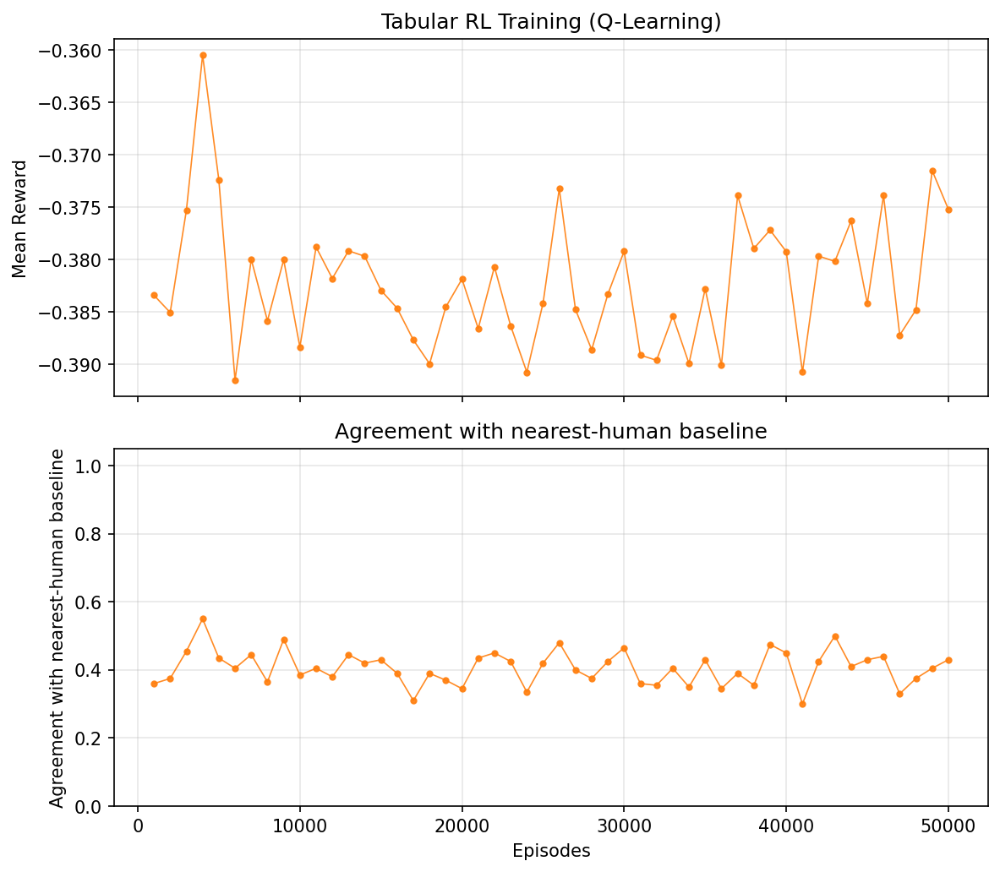

# ThessLink RL

**Reinforcement Learning** for meeting point suggestion. The model takes **Travel Effort** (agent, human distances), **Time-to-Meet**, **energy** (penalizes human travel—closer POIs cost less), and **privacy** (prefer meeting near human's location), calculates a cost for each POI, and selects the **minimum cost**.


## Overview

- **Inputs:** Human position, agent position, 3 POI suggestions (64×64 grid)
- **Cost components per POI:** Travel Effort (agent, human), energy (human effort, range [0.2, 0.8]), privacy (prefer near human), Time-to-Meet
- **Output:** POI with minimum cost
- **Reward:** `-cost` (RL learns to minimize cost)
- **Baseline:** `nearest_human_baseline` (pick POI closest to human) used for RL evaluation
- **Demo:** Shows steps + cost per POI

## Setup

```bash
python -m venv .venv
source .venv/bin/activate  # or .venv\Scripts\activate on Windows
pip install -e lb-foraging/
pip install -r requirements.txt
```

## Algorithms

Three RL categories are compared on the same environment:

| Category | Algorithm | File |
|----------|-----------|------|
| **Tabular RL** | Q-Learning | `tabular_train.py` |
| **Deep Value-based RL** | DQN | `value_based_train.py` |
| **Policy Gradient (Actor-Critic)** | PPO | `policy_based_train.py` |

## Usage

### 1. Tabular RL — Q-Learning (`tabular_train.py`)

Discretizes the 15-float observation into bins to build a Q-table. Suitable as a baseline for comparing against deep RL methods.

```bash
python tabular_train.py              # Train 50k episodes, save to models/qlearning/
python tabular_train.py --episodes 200000
python tabular_train.py --no-plot   # Skip generating training_plot_qlearning.png
python tabular_train.py --no-train  # Evaluate loaded Q-table vs baseline
```

Produces `models/qlearning/qtable.pkl` and `training_plot_qlearning.png`.



### 2. Deep Value-based RL — DQN (`value_based_train.py`)

DQN approximates Q-values with a neural network. Same env and reward as Q-Learning.

```bash
python value_based_train.py              # Train DQN 50k steps, save training_plot_dqn.png
python value_based_train.py --steps 100000
python value_based_train.py --no-plot   # Skip plot
python value_based_train.py --no-train  # Evaluate only
```

Produces `models/dqn/best_model.zip`, `models/dqn/dqn_poi_suggestion.zip`, and `training_plot_dqn.png`.


### 3. Policy Gradient (Actor-Critic) — PPO (`policy_based_train.py`)

PPO directly learns a policy (Actor-Critic). Same env and reward.

```bash
python policy_based_train.py              # Train PPO 50k steps, save to models/ppo/
python policy_based_train.py --steps 100000
python policy_based_train.py --no-plot   # Skip generating training_plot_ppo.png
python policy_based_train.py --no-train  # Evaluate loaded model vs baseline
```

Produces `models/ppo/best_model.zip`, `models/ppo/ppo_poi_suggestion.zip`, and `training_plot_ppo.png`.


### 4. Run demo (`demo.py`)

Color-coded POI labels: **green** = model suggestion, **red** = nearest-human baseline, **grey** = neither.

```bash
python demo.py                         # 5 scenarios, PPO model (default)
python demo.py --model ppo             # Policy Gradient: PPO
python demo.py --model dqn             # Deep Value-based: DQN
python demo.py --model qlearning       # Tabular RL: Q-Learning
python demo.py --model cost            # Nearest-human baseline only
python demo.py --scenarios 10
python demo.py --scenarios 0           # Infinite until window closed
python demo.py --no-visualize
```

## Project structure

```
thesslink-rl/
├── cost_function.py        # cost_components, cost_function, nearest_human_baseline
├── poi_environment.py      # Gymnasium env for POI suggestion (RL)
├── tabular_train.py        # Tabular RL: Q-Learning, suggest_poi_qlearning()
├── value_based_train.py    # Deep Value-based RL: DQN, suggest_poi_dqn()
├── policy_based_train.py   # Policy Gradient (Actor-Critic): PPO, suggest_poi_rl()
├── demo.py                 # Demo (--model ppo|dqn|qlearning|cost)
├── models/                 # RL models
│   ├── qlearning/          # Q-Learning: qtable.pkl
│   ├── dqn/                # DQN: best_model.zip, dqn_poi_suggestion.zip
│   └── ppo/                # PPO: best_model.zip, ppo_poi_suggestion.zip
├── training_plot_qlearning.png
├── training_plot_dqn.png
├── training_plot_ppo.png
├── lb-foraging/            # lb-foraging env (visualization)
├── requirements.txt
└── README.md
```

## Cost formula (current)

The current cost function combines distance, energy, privacy, and time-to-meet. Lower cost = better POI suggestion.

### Main cost

$$\text{cost} = w_{TE_a} \cdot d_A + w_{TE_h} \cdot d_H + w_e \cdot e + w_p \cdot p + w_{TTM} \cdot ttm$$

### Variable definitions

| Symbol | Formula | Description |
|--------|---------|--------------|
| $d_A$ | $\frac{\text{Manhattan}(\text{agent}, \text{POI})}{D_{\max}}$ | Travel Effort (agent → POI), normalized |
| $d_H$ | $\frac{\text{Manhattan}(\text{human}, \text{POI})}{D_{\max}}$ | Travel Effort (human → POI), normalized |
| $D_{\max}$ | $\text{rows} + \text{cols}$ | Max Manhattan distance on grid |
| $e$ | $0.2 + 0.6 \cdot d_H$ | Energy expenditure, range $[0.2, 0.8]$ |
| $p$ | $1 - d_H$ | Privacy (higher when POI near human) |
| $ttm$ | $\max(d_A, d_H)$ | Time-to-Meet |

### Weighted sum (expanded)

$$\text{cost} = w_{TE_a} \cdot d_A + w_{TE_h} \cdot d_H + w_e \cdot (0.2 + 0.6 d_H) + w_p \cdot (1 - d_H) + w_{TTM} \cdot \max(d_A, d_H)$$

Default weights: $w_{TE_a} = 0.20,\ w_{TE_h} = 0.35,\ w_e = 0.10,\ w_p = 0.10,\ w_{TTM} = 0.25$.

Human comfort is prioritized ($w_{TE_h}$ highest). `energy` and `privacy` are derivatives of $d_H$, so their weights are kept low to avoid triple-counting the same signal.

### Baseline

`nearest_human_baseline`: picks the POI with the smallest Manhattan distance to the human. Simple, interpretable heuristic — the RL model is evaluated against this.

### Related improvements / ideas

- **Fairness (minimax):** Minimize max effort instead of sum—balance burden between human and agent.
- **A* paths:** Replace Manhattan with actual path length when obstacles exist.
- **User preferences:** Learn or adapt weights per user (e.g., preference-based RL).
- **SOC vs. Makespan:** Sum-of-costs (total effort) vs. makespan (time until both meet)—already partially captured by TTM.
- **Privacy variants:** Crowd exposure, anonymity, distance from home.
- **Energy variants:** Terrain, elevation, vehicle type (e.g., drone, robot taxi, pedestrian).
- **Negotiation:** Alternating offers, Pareto-optimal compromise between human and agent preferences.

## Reinforcement Learning

- **State:** Cost components per POI (travel_effort_agent, travel_effort_human, energy, privacy, time_to_meet) × 3 POIs = 15 floats
- **Action:** Discrete(3) – which POI to suggest
- **Reward:** `-cost` – minimize cost

## Flow

1. **tabular_train.py** – Train Tabular RL (Q-Learning) → `models/qlearning/`
2. **value_based_train.py** – Train Deep Value-based RL (DQN) → `models/dqn/`
3. **policy_based_train.py** – Train Policy Gradient (PPO) → `models/ppo/`
4. **demo.py** – Load model (--model qlearning|dqn|ppo|cost) → suggest POI → visualize

## License

Uses [lb-foraging](https://github.com/semitable/lb-foraging) (MIT) for visualization. The `lb-foraging/` folder is a full copy (not a submodule) with modifications for ThessLink: `allow_agent_on_food` and `allow_agent_on_agent` so agents can move onto POIs and share cells.
